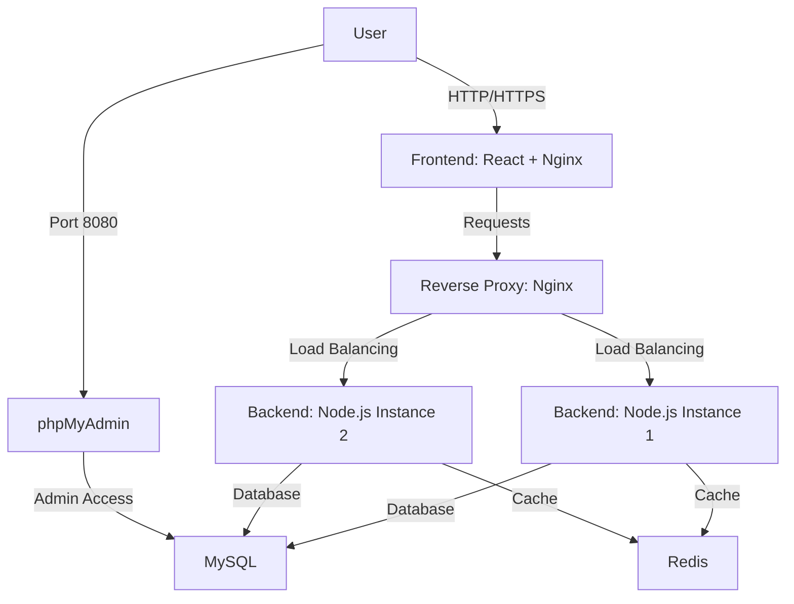

# Full-Stack Web Application Deployment with Docker Compose
# React-JS / Nginx / Node-JS / MYSQL / PHPMyadmin / Redis


This repository contains a Docker Compose configuration for deploying a full-stack web application with horizontal scaling capabilities.

## Architecture Overview



## Services

### 🖥️ Frontend Service (React + Nginx)
- Serves the React application through Nginx
- Handles HTTP/HTTPS traffic
- Custom Nginx configuration
- Static IP assignment: `10.100.10.3`
- **Access:** `http://localhost` or `https://localhost`

### 🔀 Reverse Proxy (Nginx Load Balancer)
- Routes traffic between backend instances
- Load balances requests between Node.js services
- Health monitoring of backend services
- Static IP assignment: `10.100.10.4`

### ⚙️ Backend Services (Node.js - Scaled Instances)
- **Base Backend**: Template configuration
- **Node 1 & Node 2**: Horizontally scaled instances
- Handles business logic and API requests
- Connects to MySQL and Redis
- Exposed internally on port 3000

### 🗃️ MySQL Database
- Primary relational data store
- Persistent volume for data storage
- Health checks for service readiness

### 📊 phpMyAdmin
- Web-based MySQL administration
- **Access:** `http://localhost:8080`
- Static IP assignment: `10.100.10.5`

### 🔥 Redis Cache
- In-memory data store
- Password-protected access
- Periodic data persistence
- Used for caching and session storage

## Network Configuration

| Network      | Type    | Subnet          | Purpose                          |
|--------------|---------|-----------------|----------------------------------|
| `public_net` | Bridge  | 10.100.10.0/24 | Public-facing services           |
| `private_net`| Internal| 10.100.20.0/24 | Secure backend communication     |

## Prerequisites

1. **Docker**: [Install Docker Engine](https://docs.docker.com/engine/install/)
2. **Docker Compose**: [Install Docker Compose](https://docs.docker.com/compose/install/)
3. **Git**: [Install Git](https://git-scm.com/downloads)

## Getting Started

### 1. Clone the repository
```bash
git clone https://github.com/mohamedfawzizaki/scalable-webstack-docker-mesh.git
cd scalable-webstack-docker-mesh
```
### 2. Generate SSL Certs
```bash
cd frontend/nginx/ssl
chmod +x generate-certs.sh # if in linux
./generate-certs.sh
```

### 3. Create environment files
Create the following environment files with appropriate values:
- `frontend/.env`
- `backend/backend.env`
- `database/mysql.env`
- `redis/redis.env`
- `phpmyadmin/phpmyadmin.env`

Example structure for `backend.env`:
```env
MYSQL_HOST=mysql-db
MYSQL_PORT=3306
MYSQL_USER=root
MYSQL_PASSWORD=root
MYSQL_DB=my_db

REDIS_HOST=redis
REDIS_PORT=6379
REDIS_PASSWORD=1234

PHPMYADMIN_URL=http://phpmyadmin:80
PHPMYADMIN_URL_FROM_HOST=http://localhost:8080
```

Example structure for `mysql.env`:
```env
MYSQL_ROOT_PASSWORD=root
MYSQL_DATABASE=my_db
MYSQL_USER=mo
MYSQL_PASSWORD=1234
```

Example structure for `phpmyadmin.env`:
```env
PMA_HOST=mysql-db
PMA_PORT=3306
PMA_USER=mo
PMA_PASSWORD=1234
```

Example structure for `redis.env`:
```env
REDIS_PASSWORD=1234
```

### 4. Start the application by running the following command in the root directory of your project, where compose.yml exists
```bash
docker compose up -d --build
```

### 4. Verify services are running
```bash
docker compose ps
```

## Accessing Services

| Service      | Access URL                     | Port  | Notes                     |
|--------------|--------------------------------|-------|---------------------------|
| Web App      | http://localhost               | 80    | Main application          |
|              | https://localhost              | 443   | Requires SSL setup        |
| phpMyAdmin   | http://localhost:8080          | 8080  | Database administration   |

## Configuration

### Environment Variables
Each service requires specific environment variables configured in their respective `.env` files.

### Nginx Configuration
- Frontend Nginx config: `frontend/nginx/nginx.conf`
- Reverse Proxy config: `proxy/nginx.conf`

### Scaling Backend Instances
To add more backend instances:
1. Duplicate the `node1`/`node2` service configuration
2. Update the `container_name` and `hostname`
3. Add the new service to the proxy's `depends_on` list

Example:
```yaml
node3:
  container_name: node3
  hostname: node3
  extends: 
    service: base_backend
```

Then update the proxy service:
```yaml
proxy:
  depends_on:
    - base_backend
    - node1
    - node2
    - node3  # Add new instance
```

## Production Considerations

1. **Secrets Management**: Replace `env_file` with Docker secrets
2. **Resource Limits**: Add resource constraints to services
3. **SSL/TLS**: Configure proper certificates for HTTPS
4. **Monitoring**: Implement health checks and logging
5. **High Availability**: Consider database replication

## Maintenance Commands

| Command                            | Description                                  |
|------------------------------------|----------------------------------------------|
| `docker compose up -d --build`     | Start all services in background             |
| `docker compose down`              | Stop and remove all containers               |
| `docker compose logs -f service`   | View logs for a specific service            |
| `docker compose restart service`   | Restart a specific service                  |
| `docker compose ps`                | View status of all services                 |
| `docker compose exec service bash` | Access shell inside a running container     |

## 📧 Contact

Mohamed Fawzi Zaki - mohamedfawzizaki@gmail.com

Project Link: [https://github.com/mohamedfawzizaki/scalable-webstack-docker-mesh]
---
